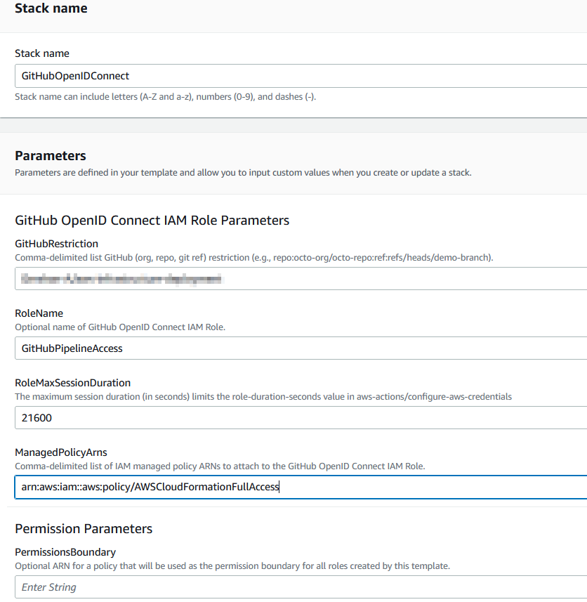
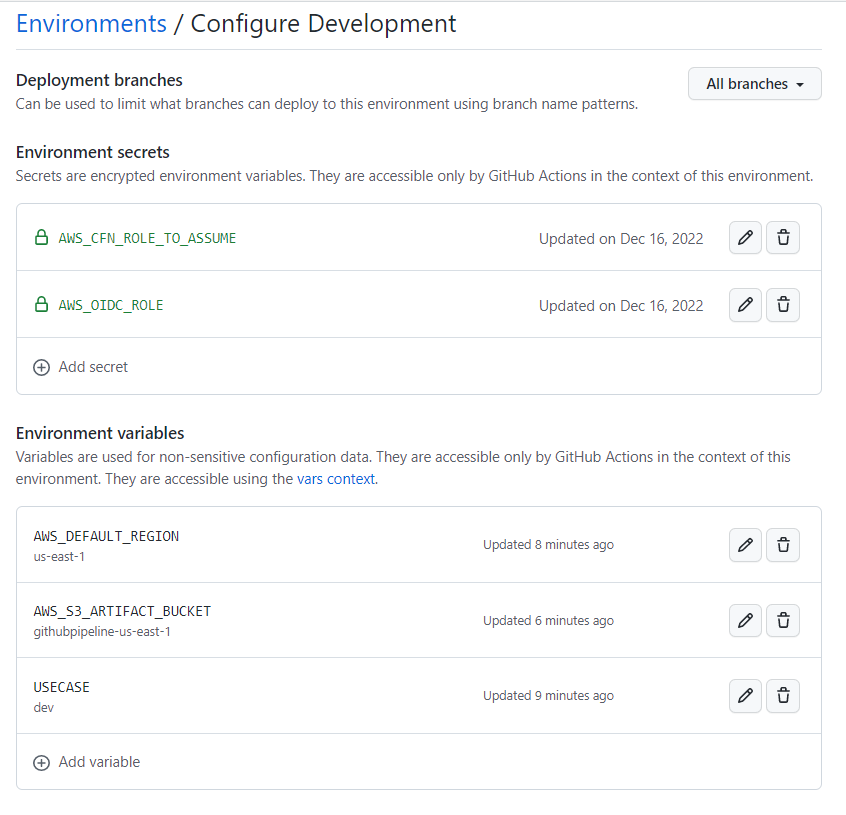

# GitHub Actions for multiple Environments deployment
Motivation: Flexible and easy-to-use workflow for multiple Environments deployment to AWS.
### Pre requirements
1. GitHub OpenID Connect already installed on the AWS account.
https://docs.github.com/en/actions/deployment/security-hardening-your-deployments/configuring-openid-connect-in-amazon-web-services
IAM Role for the `OpenID Connect` should have limited permissions scoped to specific repository only.
The GitHub OIDC Provider only needs to be created once per AWS account.
S3 bucket to store Stack templates.
Additional IAM Roles could be attached to the OpenID Provider later. ( e.g access to S3, ECR)
Following Stack example will:
- Create Identity provider.
- IAM role with AWSCloudFormationFullAccess.
- Create S3 Bucket for storing artifacts and CFN templates.
- Policy to access previously created artifacts bucket.
- `PassRolePolicy` for CloudFormation Role.
- ForGitHub Restriction, we could use following format  `repo:ORG_OR_USER_NAME/REPOSITORY:environment:Development`
```yaml
---
# Copyright 2018 widdix GmbH
#
# Licensed under the Apache License, Version 2.0 (the "License");
# you may not use this file except in compliance with the License.
# You may obtain a copy of the License at
#
#     http://www.apache.org/licenses/LICENSE-2.0
#
# Unless required by applicable law or agreed to in writing, software
# distributed under the License is distributed on an "AS IS" BASIS,
# WITHOUT WARRANTIES OR CONDITIONS OF ANY KIND, either express or implied.
# See the License for the specific language governing permissions and
# limitations under the License.
AWSTemplateFormatVersion: '2010-09-09'
Description: 'Operations: GitHub OpenID Connect template'
Metadata:
  'AWS::CloudFormation::Interface':
    ParameterGroups:
    - Label:
        default: 'GitHub OpenID Connect IAM Role Parameters'
      Parameters:
      - GitHubRestriction
      - RoleName
      - RoleMaxSessionDuration
      - ManagedPolicyArns
    - Label:
        default: 'Permission Parameters'
      Parameters:
      - PermissionsBoundary
Parameters:
  GitHubRestriction:
    Description: 'Comma-delimited list GitHub (org, repo, git ref) restriction (e.g., repo:octo-org/octo-repo:ref:refs/heads/demo-branch).'
    Type: String
  RoleName:
    Description: 'Optional name of GitHub OpenID Connect IAM Role.'
    Type: String
    Default: ''
  RoleMaxSessionDuration:
    Description: 'The maximum session duration (in seconds) limits the role-duration-seconds value in aws-actions/configure-aws-credentials'
    Type: Number
    MinValue: 3600
    MaxValue: 43200
    Default: 21600
  ManagedPolicyArns:
    Description: 'Comma-delimited list of IAM managed policy ARNs to attach to the GitHub OpenID Connect IAM Role.'
    Type: String
    Default: 'arn:aws:iam::aws:policy/AdministratorAccess'
  PermissionsBoundary:
    Description: 'Optional ARN for a policy that will be used as the permission boundary for all roles created by this template.'
    Type: String
    Default: ''
Conditions:
  HasRoleName: !Not [!Equals [!Ref RoleName, '']]
  HasPermissionsBoundary: !Not [!Equals [!Ref PermissionsBoundary, '']]
Resources:
  Role:
    Type: 'AWS::IAM::Role'
    Properties:
      RoleName: !If [HasRoleName, !Ref RoleName, !Ref 'AWS::NoValue']
      AssumeRolePolicyDocument:
        Version: '2012-10-17'
        Statement:
        - Effect: Allow
          Principal:
            Federated: !Ref OIDCProvider
          Action: 'sts:AssumeRoleWithWebIdentity'
          Condition:
            StringEquals:
              'token.actions.githubusercontent.com:aud': 'sts.amazonaws.com'
            StringLike:
              'token.actions.githubusercontent.com:sub': !Split [',', !Ref GitHubRestriction]
      ManagedPolicyArns: !Split [',', !Ref ManagedPolicyArns]
      MaxSessionDuration: !Ref RoleMaxSessionDuration
      PermissionsBoundary: !If [HasPermissionsBoundary, !Ref PermissionsBoundary, !Ref 'AWS::NoValue']
      Policies:
        - PolicyName: S3Access
          PolicyDocument:
            Statement:
              - Action: '*'
                Resource:
                  - !Sub 'arn:aws:s3:::githubpipeline-${AWS::Region}-${AWS::AccountId}'
                  - !Sub 'arn:aws:s3:::githubpipeline-${AWS::Region}-${AWS::AccountId}/*'
                  - !GetAtt PipelineBucket.Arn
                Effect: Allow
            Version: '2012-10-17'
      Tags:
        - Key: Department
          Value: Engineering
        - Key: Region
          Value: !Ref 'AWS::Region'
  OIDCProvider:
    Type: 'AWS::IAM::OIDCProvider'
    Properties:
      ClientIdList:
      - 'sts.amazonaws.com'
      ThumbprintList:
      - '6938FD4D98BAB03FAADB97B34396831E3780AEA1'
      Url: 'https://token.actions.githubusercontent.com'
  PipelineBucket:
    Type: AWS::S3::Bucket
    Properties:
      BucketName: !Sub githubpipeline-${AWS::Region}-${AWS::AccountId}
      BucketEncryption:
        ServerSideEncryptionConfiguration:
          - ServerSideEncryptionByDefault:
              SSEAlgorithm: AES256
      LifecycleConfiguration:
        Rules:
          - ExpirationInDays: 180
            Id: Expire objects in 180 days
            Status: Enabled

Outputs:
  TemplateID:
    Description: 'template id.'
    Value: 'operations/github-openid-connect'
  TemplateVersion:
    Description: 'template version.'
    Value: '__VERSION__'
  StackName:
    Description: 'Stack name.'
    Value: !Sub '${AWS::StackName}'
  RoleName:
    Description: 'GitHub OpenID Connect IAM Role name.'
    Value: !Ref Role
    Export:
      Name: !Sub '${AWS::StackName}-RoleName'
  RoleArn:
    Description: 'GitHub OpenID Connect IAM Role ARN.'
    Value: !GetAtt 'Role.Arn'
    Export:
      Name: !Sub '${AWS::StackName}-RoleArn'
  PipelineBucket:
    Description: 'PipelineBucket to store artifacts and CFN templates.'
    Value: !Ref PipelineBucket
    Export:
      Name: !Sub 'githubpipeline-${AWS::Region}-${AWS::AccountId}'
```


2. CloudFormation IAM Role that will be assumed during deployment.
Scoped to specific repository, have only necessary permissions policies.
(currently, I'm using kind of wide permissions policy)
```yaml
AWSTemplateFormatVersion: '2010-09-09'
Description: Setup CloudFormation role for GitHub actions.
Resources:
  GitHubPipelineCloudFormationRole:
    Type: AWS::IAM::Role
    Properties:
      RoleName: GitHubPipelineCloudFormationRole
      AssumeRolePolicyDocument:
        Version: 2012-10-17
        Statement:
          - Effect: Allow
            Principal:
              Service: cloudformation.amazonaws.com
            Action: sts:AssumeRole
      ManagedPolicyArns:
        - arn:aws:iam::aws:policy/AWSCloudFormationFullAccess
        - arn:aws:iam::aws:policy/AmazonS3FullAccess
        - arn:aws:iam::aws:policy/AmazonEC2FullAccess
        - arn:aws:iam::aws:policy/AmazonSSMFullAccess
        - arn:aws:iam::aws:policy/IAMFullAccess
        - arn:aws:iam::aws:policy/AmazonEKSClusterPolicy
      Path: /
```
### GitHub Repository configuration
1. Create 3 (or more) environments. In our case the environments as following:
- Development
- Staging
- Production
2. Define allowed branches per environment.
Example: I added `main` and `ci-cd` for Development.
3. We create secrets per environments. So, workflows can access secrets of desired environment only.




Example:
`AWS_OIDC_ROLE`          - OpenID Connect role ARN `arn:aws:iam::XXXXXXXXXX:role/OpenIDConnect`<br />
`AWS_CFN_ROLE_TO_ASSUME` - will be assumed later in pipeline by CloudFormation when we deploy to Dev environment.<br />
`AWS_S3_BUCKET`          - S3 artifact bucket that OpenIDConnect role have access to.
`AWS_DEFAULT_REGION`     - default region to use.<br />
`USECASE`                - used to pass additional arguments to CloudFormation template. This is allowing us to deploy different configurations to the same AWS account.<br />
For example:
For dev we using `dev-EKSCluster-us-east-1.json`. We can create additional configuration set like `performance-EKSCluster-us-east-1.json`

```yaml
role-arn: "${{ secrets.AWS_CFN_ROLE_TO_ASSUME }}"
```
### Branch strategies
1. Any branches that are not explicitly set to `feature/xxxx` will be considered as development and deployed to AWS `dev` environment.
2. Any branches that set to `feature/xxxx` will be considered as staging and deployed to AWS `stage` environment.
3. Releases with TAG will be considered as production and deployed to AWS `prod` environment.

### CloudFormation Templates Config
We put set of parameters for CloudFormation template that will be used in the deployment.
(we can add as many as we need in format [USECASE]-[TEMPATE NAME]-[Region])
### The Workflow
This workflow will be bringing up AWS resources for desired environment:
- GlobalRoles
- VPC
- Set of roles for EKS Cluster
- EKS cluster


## ToDo
1. Slack notification
2. Comment on Pull Request With changeset.